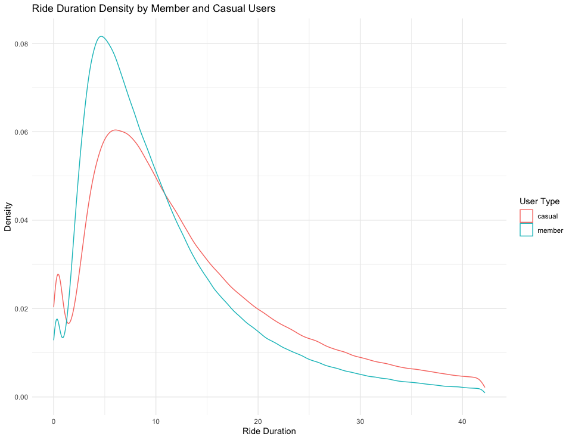
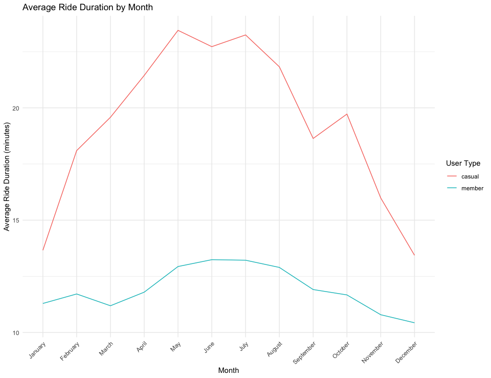
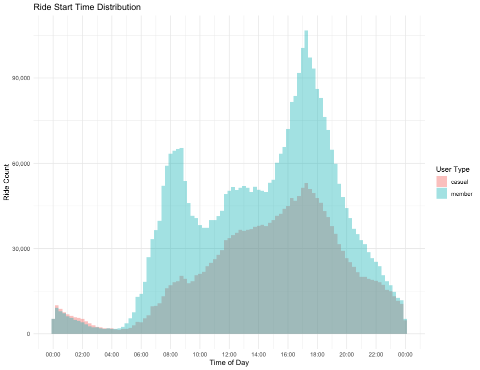
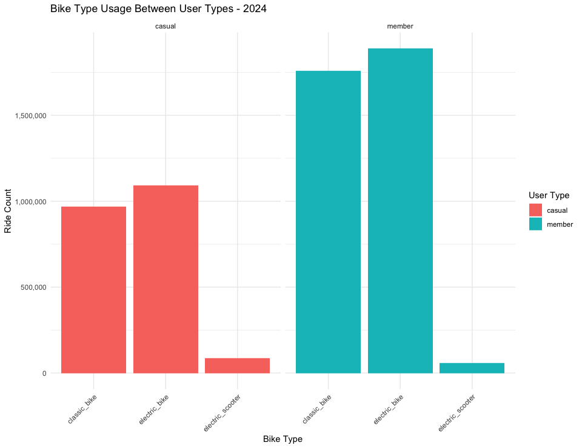

Cyclistic Case Study
================
2025-02-06

## Introduction

This capstone project is the final requirement for the Google Data
Analytics course, featuring a fictional bike-share company based in
Chicago called Cyclistic. The goal of this analysis is to support
Cyclist’s marketing team in developing a strategy to convert casual
riders into annual members. This study aims to identify key differences
in how casual riders and annual members use Cyclistic bikes. The data
analysis process—Ask, Prepare, Process, Analyze, Share, and Act—will
guide this project. The analysis will be conducted using R for data
cleaning, exploration, and visualization.

## Ask

Cyclistic aims to understand how annual members and casual riders differ
in their usage patterns. Annual members are currently more profitable
than casual riders, presenting an opportunity for growth through
targeted marketing strategies.

This analysis seeks to:

- Identify usage patterns, trip behaviors, and trends among casual
  riders and annual members
- Analyze 12 months of historical bike-share data to uncover key
  insights
- Provide data-driven recommendations to support the marketing team’s
  goal of increasing annual memberships

The final findings will be presented to the Marketing Director and the
Cyclistic Executive Team to inform strategic decisions.

## Prepare

load packages

``` r
library(tidyverse)
library(lubridate)
library(ggplot2)
library(readr)
library(janitor)
library(geosphere)
library(dplyr)
library(pastecs)
library(scales)
```

<br> Load data frames. I will be using the 2024 data, which is the most
recent data from the last 12 months at the time of this report.

``` r
JAN_2024 <- read_csv("Data/202401-divvy-tripdata.csv")
FEB_2024 <- read_csv("Data/202402-divvy-tripdata.csv")
MAR_2024 <- read_csv("Data/202403-divvy-tripdata.csv")
APR_2024 <- read_csv("Data/202404-divvy-tripdata.csv")
MAY_2024 <- read_csv("Data/202405-divvy-tripdata.csv")
JUN_2024 <- read_csv("Data/202406-divvy-tripdata.csv")
JUL_2024 <- read_csv("Data/202407-divvy-tripdata.csv")
AUG_2024 <- read_csv("Data/202408-divvy-tripdata.csv")
SEP_2024 <- read_csv("Data/202409-divvy-tripdata.csv")
NOV_2024 <- read_csv("Data/202411-divvy-tripdata.csv")
OCT_2024 <- read_csv("Data/202410-divvy-tripdata.csv")
DEC_2024 <- read_csv("Data/202412-divvy-tripdata.csv")
```

## Process

Compares columns names/type across multiple data frames. This confirms
that the column names and data types are consistent across all data
frames used.

``` r
compare_df_cols(JAN_2024, FEB_2024, MAR_2024, APR_2024, MAY_2024, JUN_2024, JUL_2024, AUG_2024, SEP_2024, OCT_2024, NOV_2024, DEC_2024)
```

    ##           column_name        JAN_2024        FEB_2024        MAR_2024
    ## 1             end_lat         numeric         numeric         numeric
    ## 2             end_lng         numeric         numeric         numeric
    ## 3      end_station_id       character       character       character
    ## 4    end_station_name       character       character       character
    ## 5            ended_at POSIXct, POSIXt POSIXct, POSIXt POSIXct, POSIXt
    ## 6       member_casual       character       character       character
    ## 7             ride_id       character       character       character
    ## 8       rideable_type       character       character       character
    ## 9           start_lat         numeric         numeric         numeric
    ## 10          start_lng         numeric         numeric         numeric
    ## 11   start_station_id       character       character       character
    ## 12 start_station_name       character       character       character
    ## 13         started_at POSIXct, POSIXt POSIXct, POSIXt POSIXct, POSIXt
    ##           APR_2024        MAY_2024        JUN_2024        JUL_2024
    ## 1          numeric         numeric         numeric         numeric
    ## 2          numeric         numeric         numeric         numeric
    ## 3        character       character       character       character
    ## 4        character       character       character       character
    ## 5  POSIXct, POSIXt POSIXct, POSIXt POSIXct, POSIXt POSIXct, POSIXt
    ## 6        character       character       character       character
    ## 7        character       character       character       character
    ## 8        character       character       character       character
    ## 9          numeric         numeric         numeric         numeric
    ## 10         numeric         numeric         numeric         numeric
    ## 11       character       character       character       character
    ## 12       character       character       character       character
    ## 13 POSIXct, POSIXt POSIXct, POSIXt POSIXct, POSIXt POSIXct, POSIXt
    ##           AUG_2024        SEP_2024        OCT_2024        NOV_2024
    ## 1          numeric         numeric         numeric         numeric
    ## 2          numeric         numeric         numeric         numeric
    ## 3        character       character       character       character
    ## 4        character       character       character       character
    ## 5  POSIXct, POSIXt POSIXct, POSIXt POSIXct, POSIXt POSIXct, POSIXt
    ## 6        character       character       character       character
    ## 7        character       character       character       character
    ## 8        character       character       character       character
    ## 9          numeric         numeric         numeric         numeric
    ## 10         numeric         numeric         numeric         numeric
    ## 11       character       character       character       character
    ## 12       character       character       character       character
    ## 13 POSIXct, POSIXt POSIXct, POSIXt POSIXct, POSIXt POSIXct, POSIXt
    ##           DEC_2024
    ## 1          numeric
    ## 2          numeric
    ## 3        character
    ## 4        character
    ## 5  POSIXct, POSIXt
    ## 6        character
    ## 7        character
    ## 8        character
    ## 9          numeric
    ## 10         numeric
    ## 11       character
    ## 12       character
    ## 13 POSIXct, POSIXt

<br> Merge all 12 data frames for 2024 together to consolidate analysis.

``` r
#merge 2024 data frames together
merged_2024 <- bind_rows(JAN_2024, FEB_2024, MAR_2024, APR_2024, MAY_2024, JUN_2024, JUL_2024, AUG_2024, SEP_2024, OCT_2024, NOV_2024, DEC_2024)
```

<br> Count the number of n/a values in each column to assess data
completeness. This results in approximately ~18-19% of missing data from
the station names and station id columns. Since this information is not
essential for analyzing ride times, ride counts, or seasonality, I have
chosen to retain the incomplete data.

``` r
#count n/a values in column
colSums(is.na(merged_2024))
```

    ##            ride_id      rideable_type         started_at           ended_at 
    ##                  0                  0                  0                  0 
    ## start_station_name   start_station_id   end_station_name     end_station_id 
    ##            1073951            1073951            1104653            1104653 
    ##          start_lat          start_lng            end_lat            end_lng 
    ##                  0                  0               7232               7232 
    ##      member_casual 
    ##                  0

<br> Add a new column that calculates a trips ride time in minutes by
finding the time difference between started_at and ended_at column. I’ve
also added a date

``` r
merged_2024 <- merged_2024 %>%
  distinct() %>% #remove duplicates
  mutate(ride_time_min = difftime(ended_at, started_at, units = "min")) %>%  #add column that calculates the ride time in minutes
  arrange(desc(ride_time_min)) %>% 
  mutate(day_of_week = wday(started_at, label = TRUE, abbr = FALSE)) %>% #add date_of_week column 
  mutate(ride_month = month(started_at, label = TRUE, abbr = FALSE)) %>% #add ride_month column  %>% 
  mutate(start_time_only = hms(format(started_at, format = "%H:%M:%S")))
```

Remove negative values in ride_time_min column and any ride times
greater than 24 hrs. These values are

``` r
#remove negative values in ride_time_min column and ride times greater than 24 hrs.
merged_2024 <- merged_2024 %>%  
  filter(ride_time_min > 0, ride_time_min <= 1440)
```

## Analyze

Perform description analysis on ride_time_min column across all users.

- Minimum ride time is 0. This demonstrates that users are quickly
  un-docking and re-docking bikes without starting a ride.
- Max ride time is 1439 min. Rides longer than 1440 min (24 hrs) have
  been removed from the data.
- Median ride time is 9.70 min. Many users are taking shorter trips.
- Mean is 15.40 which is larger than the medium. The data is
  right-skewed due to users with exceptionally long ride times.

``` r
round(stat.desc(merged_2024$ride_time_min), 2)
```

    ##                        x
    ## nbr.val       5852249.00
    ## nbr.null            0.00
    ## nbr.na              0.00
    ## min                 0.00
    ## max              1439.93
    ## range            1439.93
    ## sum          90098575.60
    ## median              9.70
    ## mean               15.40
    ## SE.mean             0.01
    ## CI.mean.0.95        0.02
    ## var               944.14
    ## std.dev            30.73
    ## coef.var            2.00

<br> Perform descriptive statistical analysis on ride_time_min column by
user type.

- Total Rides: Members make up 63.3% of total rides with 3,707,005 rides
  versus 2,145,244 rides for casual users.
- Casual riders take longer rides than members with a higher mean
  (12.02) and median (20.93 min) compared to members.
- Casual riders have a higher standard deviation (42.46 min), meaning
  their ride times vary widely.

``` r
# Descriptive statistics for members
round(stat.desc(merged_2024$ride_time_min[merged_2024$member_casual == "member"]),2)
```

    ##                        x
    ## nbr.val       3707005.00
    ## nbr.null            0.00
    ## nbr.na              0.00
    ## min                 0.00
    ## max              1439.93
    ## range            1439.93
    ## sum          45207002.44
    ## median              8.69
    ## mean               12.20
    ## SE.mean             0.01
    ## CI.mean.0.95        0.02
    ## var               419.12
    ## std.dev            20.47
    ## coef.var            1.68

``` r
# Descriptive statistics for casual users
round(stat.desc(merged_2024$ride_time_min[merged_2024$member_casual == "casual"]), 2)
```

    ##                        x
    ## nbr.val       2145244.00
    ## nbr.null            0.00
    ## nbr.na              0.00
    ## min                 0.00
    ## max              1439.93
    ## range            1439.93
    ## sum          44891573.16
    ## median             12.02
    ## mean               20.93
    ## SE.mean             0.03
    ## CI.mean.0.95        0.06
    ## var              1803.10
    ## std.dev            42.46
    ## coef.var            2.03

Calculate the average ride time by month and user type.

``` r
#calculate avg ride_time by month and user type
ride_time_month <- merged_2024 %>% 
  group_by(member_casual, ride_month) %>% 
  summarise(mean = mean(ride_time_min))
```

    ## `summarise()` has grouped output by 'member_casual'. You can override using the
    ## `.groups` argument.

``` r
as_tibble(ride_time_month)
```

    ## # A tibble: 24 × 3
    ##    member_casual ride_month mean         
    ##    <chr>         <ord>      <drtn>       
    ##  1 casual        January    13.66143 mins
    ##  2 casual        February   18.09625 mins
    ##  3 casual        March      19.58065 mins
    ##  4 casual        April      21.44337 mins
    ##  5 casual        May        23.45044 mins
    ##  6 casual        June       22.72396 mins
    ##  7 casual        July       23.24570 mins
    ##  8 casual        August     21.82665 mins
    ##  9 casual        September  18.63685 mins
    ## 10 casual        October    19.72420 mins
    ## # ℹ 14 more rows

Calculate the number of rides by month and user type.

``` r
num_rides_month <- merged_2024 %>% 
  count(member_casual, ride_month, name = "num_rides")

as_tibble(num_rides_month)
```

    ## # A tibble: 24 × 3
    ##    member_casual ride_month num_rides
    ##    <chr>         <ord>          <int>
    ##  1 casual        January        24320
    ##  2 casual        February       46931
    ##  3 casual        March          82200
    ##  4 casual        April         131337
    ##  5 casual        May           230327
    ##  6 casual        June          300153
    ##  7 casual        July          319560
    ##  8 casual        August        317542
    ##  9 casual        September     345854
    ## 10 casual        October       215933
    ## # ℹ 14 more rows

Find the top 10 start stations for member and casual users.

``` r
top_stations <- merged_2024 %>% 
  count(member_casual, start_station_name, name = "station_count") %>% 
  arrange(desc(station_count)) %>% 
  filter(!is.na(start_station_name)) %>% 
  group_by(member_casual) %>% 
  top_n(10, station_count)

as_tibble(top_stations)
```

    ## # A tibble: 20 × 3
    ##    member_casual start_station_name                 station_count
    ##    <chr>         <chr>                                      <int>
    ##  1 casual        Streeter Dr & Grand Ave                    50903
    ##  2 casual        DuSable Lake Shore Dr & Monroe St          33965
    ##  3 member        Kingsbury St & Kinzie St                   29515
    ##  4 member        Clinton St & Washington Blvd               27729
    ##  5 casual        Michigan Ave & Oak St                      25058
    ##  6 member        Clinton St & Madison St                    24886
    ##  7 member        Clark St & Elm St                          24703
    ##  8 casual        DuSable Lake Shore Dr & North Blvd         23033
    ##  9 casual        Millennium Park                            22498
    ## 10 casual        Shedd Aquarium                             21020
    ## 11 member        Wells St & Concord Ln                      20667
    ## 12 member        Wells St & Elm St                          20489
    ## 13 member        Clinton St & Jackson Blvd                  20301
    ## 14 member        Dearborn St & Erie St                      19484
    ## 15 member        Canal St & Madison St                      19076
    ## 16 member        State St & Chicago Ave                     19054
    ## 17 casual        Dusable Harbor                             18390
    ## 18 casual        Theater on the Lake                        16773
    ## 19 casual        Michigan Ave & 8th St                      13456
    ## 20 casual        Adler Planetarium                          12879

Find the count of bike usage based on bike type between casual and
member riders.

``` r
bike_type <- merged_2024 %>% 
  group_by(member_casual, rideable_type) %>% 
  summarize(count = n())
```

    ## `summarise()` has grouped output by 'member_casual'. You can override using the
    ## `.groups` argument.

``` r
as_tibble(bike_type)
```

    ## # A tibble: 6 × 3
    ##   member_casual rideable_type      count
    ##   <chr>         <chr>              <int>
    ## 1 casual        classic_bike      968778
    ## 2 casual        electric_bike    1091251
    ## 3 casual        electric_scooter   85215
    ## 4 member        classic_bike     1759184
    ## 5 member        electric_bike    1888699
    ## 6 member        electric_scooter   59122

Calculate ride counts by day of the week among all users as well as
between user type.

``` r
#all users
table(merged_2024$day_of_week)
```

    ## 
    ##    Sunday    Monday   Tuesday Wednesday  Thursday    Friday  Saturday 
    ##    785568    787244    802204    878586    834701    840501    923445

``` r
#member vs. casual
day_count <- merged_2024 %>% 
    group_by(member_casual, day_of_week) %>% 
    summarize(ride_count = n())
```

    ## `summarise()` has grouped output by 'member_casual'. You can override using the
    ## `.groups` argument.

``` r
as_tibble(day_count)
```

    ## # A tibble: 14 × 3
    ##    member_casual day_of_week ride_count
    ##    <chr>         <ord>            <int>
    ##  1 casual        Sunday          368571
    ##  2 casual        Monday          252900
    ##  3 casual        Tuesday         231817
    ##  4 casual        Wednesday       268632
    ##  5 casual        Thursday        264401
    ##  6 casual        Friday          314918
    ##  7 casual        Saturday        444005
    ##  8 member        Sunday          416997
    ##  9 member        Monday          534344
    ## 10 member        Tuesday         570387
    ## 11 member        Wednesday       609954
    ## 12 member        Thursday        570300
    ## 13 member        Friday          525583
    ## 14 member        Saturday        479440

Calculate number of ride by month between user type.

``` r
#ride count by month
month_count <- merged_2024 %>% 
  group_by(member_casual, ride_month) %>% 
  summarize(ride_count = n())
```

    ## `summarise()` has grouped output by 'member_casual'. You can override using the
    ## `.groups` argument.

``` r
as_tibble(month_count)
```

    ## # A tibble: 24 × 3
    ##    member_casual ride_month ride_count
    ##    <chr>         <ord>           <int>
    ##  1 casual        January         24320
    ##  2 casual        February        46931
    ##  3 casual        March           82200
    ##  4 casual        April          131337
    ##  5 casual        May            230327
    ##  6 casual        June           300153
    ##  7 casual        July           319560
    ##  8 casual        August         317542
    ##  9 casual        September      345854
    ## 10 casual        October        215933
    ## # ℹ 14 more rows

## Share

#### Ride Duration

For members, the higher density peak at ~4 minutes suggests they
frequently take short, consistent rides. In contrast, casual users have
a lower density peak at ~7 minutes, indicating longer rides on average
but with greater variability in ride duration. Both groups exhibit a
right-skewed distribution, with casual users’ distribution being
slightly higher in the right tail. This suggests that while longer rides
occur in both groups, a higher proportion of casual users take extended
rides.

``` r
quantile(merged_2024$ride_time_min, probs = c(0.95, 0.99, 0.999), na.rm = TRUE)
```

    ## Time differences in mins
    ##       95%       99%     99.9% 
    ##  42.23854  94.68717 333.38253

``` r
merged_2024_filtered_ride_time <- merged_2024 %>%
  filter(ride_time_min <= 42.2)

ggplot(merged_2024_filtered_ride_time, aes(ride_time_min, color=member_casual)) + 
  geom_density() +
  xlim(0, 42.2) +
  theme_minimal() +
  labs(title = "Ride Duration Density by Member and Casual Users",
       x = "Ride Duration",
       y = "Density",
      color = "User Type")
```

<!-- -->

On a month to month basis, casual users on average take longer rides
than members. This suggests that casual riders are using the bikes for
leisure and are more likely to opt for full-day passes. The months with
the highest ride duration for both casual users and members are the
summer months May through July. The winter months Nov through Jan have
the lowest ride duration. For members, ride duration increases less
dramatically during peak months compared to casual riders, indicating
more consistent usage throughout the year.

``` r
#plots the average ride duration by month between casual and members
ggplot(ride_time_month, aes(x = ride_month, y = mean, color = member_casual, group = member_casual)) +
  geom_line() + 
  labs(title = "Average Ride Duration by Month",
       x = "Month",
       y = "Average Ride Duration (minutes)",
       color = "User Type") +
  theme_minimal() +
  scale_y_continuous() +
  theme(axis.text.x = element_text(angle = 45, hjust = 1))
```

<!-- --> \#### Seasonality Although
members are taking shorter rides, they are taking more rides than casual
users. The number of rides increases for all users from June to
September, followed by a sharp decline from November to January. For
both groups, this shows that seasonality makes an impact on number of
rides for both groups.

``` r
  ggplot(month_count, aes(x = ride_month, y = ride_count, , color = member_casual, group = member_casual)) + 
    geom_line() +
    scale_y_continuous(labels = comma) +
    labs(title = "Ride Count By Month and User Type - 2024", 
         x = "Day of the Week", 
         y = "Ride Count",
         fill = "User Type") +
    theme_minimal() +
    theme(axis.text.x = element_text(angle = 45, hjust = 1))
```

<!-- -->

#### Weekday vs. Weekend Ridership

On a weekly basis, members take more rides on the weekday and casual
members take more rides on the weekends. For members, Wednesday has the
highest ride count, with Saturday being the lowest. For casual user, we
see the opposite. Saturday had the highest ride count with Tuesday
having the lowest.

``` r
  ggplot(day_count, aes(x = day_of_week, y = ride_count, , color = member_casual, group = member_casual)) + 
    geom_line() +
    scale_y_continuous(labels = comma) +
    labs(title = "Ride Count By Day of the Week and User Type - 2024", 
         x = "Day of the Week", 
         y = "Ride Count",
         fill = "User Type") +
    theme_minimal() +
   theme(axis.text.x = element_text(angle = 45, hjust = 1))
```

<!-- -->

Members tend to start their rides between 8:00 AM and 10:00 AM before
experiencing a slight dip. Around noon, ride activity begins to increase
again, peaking at approximately 5:00 PM. In contrast, casual riders do
not exhibit noticeable spikes in the morning. Instead, their ride counts
steadily rise from 8:00 AM, reaching a peak around 5:00 PM. The busiest
period for casual riders is between 2:00 PM and 7:00 PM.

``` r
ggplot(merged_2024, aes(x = start_time_only, fill = member_casual)) +
  geom_histogram(binwidth = 15 * 60, alpha = 0.4, position = "identity") +
  scale_x_time(
    breaks = seq(0, 24 * 60 * 60, by = 2 * 60 * 60),  # 2-hour breaks (in seconds)
    labels = scales::time_format("%H:%M")
  ) +
  scale_y_continuous(labels = scales::comma) +
  labs(
    title = "Ride Start Time Distribution",
    x = "Time of Day",
    y = "Ride Count",
    fill = "User Type"
  ) +
  theme_minimal()
```

<!-- -->

#### Top stations

The top 10 start stations for casual members show they are starting
their rides around popular tourist areas.

``` r
#Bar chart for top start stations between casual and member riders
ggplot(top_stations, aes(x = reorder(start_station_name, station_count), y = station_count, fill = member_casual)) +
  geom_col() +
  coord_flip() +
  facet_wrap(~ member_casual, scales = "free_y") +
  labs(title = "Top 20 Stations by User Type - 2024", 
       x = "Station Name", 
       y = "Ride Count",
       fill="User Type") +
  theme_minimal() +
  theme(axis.text.x = element_text(angle = 45, hjust = 1))
```

<!-- -->

#### Bike Type

The most used bike types for all members are the electric bikes followed
by classic bikes. Electric scooters are the least popular, but there
will need to be further investigation to see if this is due to
availability of bike types.

``` r
#Bar chart of bike type usage between users
bike_type_plot <- ggplot(bike_type, aes(x = rideable_type, y = count, fill = member_casual)) +
  geom_col() +
  scale_y_continuous(labels = comma) +
  facet_wrap(~member_casual) + 
  labs(title = "Bike Type Usage Between User Types - 2024", 
       x = "Bike Type", 
       y = "Ride Count",
       fill = "User Type")+
  theme_minimal() +
  theme(axis.text.x = element_text(angle = 45, hjust = 1))

#ggsave("plots/bike_type_usage.png", plot = bike_type_plot, width = 6, height = 4, dpi = 300)

bike_type_plot
```

<!-- -->

## Insight summary and recommendations

### 1. Seasonality Drives Demand:

#### Summary:

- Both casual and member riders increase usage in the summer (May–July)
  and drop significantly in winter (Nov–Jan).
- Casual riders show more extreme seasonal fluctuations, while members
  maintain a more consistent level of use.

#### Recommendation:

- Offer discounted rates for memberships during off-peak seasons
- Provide tips and messaging on how to prepare for rides in the winter
  months.

### 2. Casual Riders Take Longer Trips:

#### Summary:

- Casual riders have a higher average ride time (20.93 min vs. 12.02 min
  for members) and a higher standard deviation in ride duration.
- This suggests that casual riders are using bikes more for leisure,
  sightseeing, or long trips, while members likely use bikes for
  commuting or short, frequent trips.

#### Recommendation:

- Offer discounted full-day membership packs for frequent casual riders.
  For example, 10-pack of full day rides.
- Consider partnerships with local tour groups or create a multi-day
  sightseeing guide to complement full-day ride plans.

### 3. Members Ride More Often, Especially on Weekdays:

#### Summary:

- Members account for 63.3% of total rides despite taking shorter trips.
- Their rides peak on weekdays, especially Wednesdays, suggesting they
  use the service for commuting.
- Casual riders peak on weekends, indicating more recreational use.

#### Recommendation:

- Introduce a weekend only membership plan at a discounted rate.
